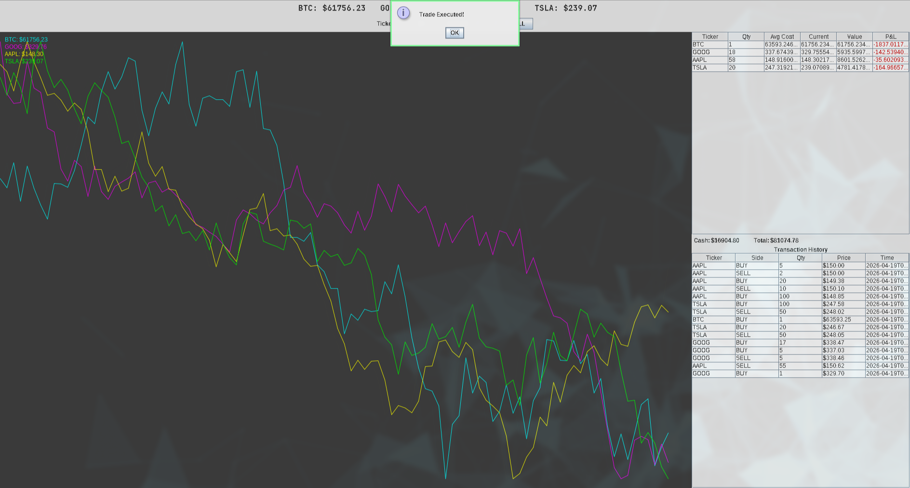
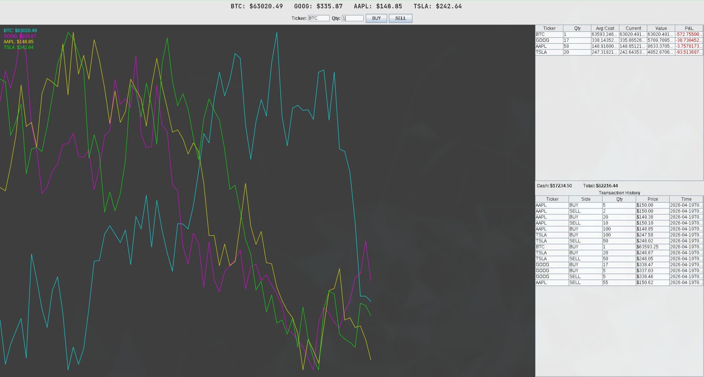
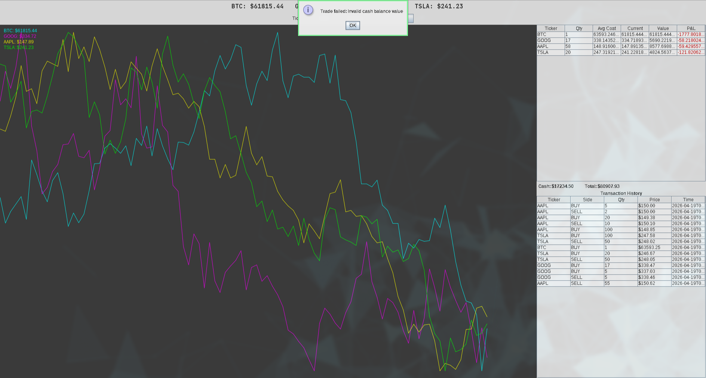

# 📈 Interactive Algorithmic Financial Portfolio Simulator

A real-time financial marketplace simulator built in Java, where users trade stocks and cryptocurrencies with simulated prices driven by **Geometric Brownian Motion** — the same stochastic model behind Black-Scholes options pricing.

> **Course:** Object-Oriented Programming (CS2016)

---

## ✨ Features

- **Live Price Simulation** — Asset prices update every second using GBM with realistic drift and volatility
- **Multi-Asset Trading** — Trade equities (AAPL, TSLA, GOOG) and crypto (BTC) with a $100,000 virtual balance
- **Real-Time Chart** — Custom-rendered line graph with `Graphics2D`, anti-aliasing, and color-coded asset lines
- **Portfolio Tracking** — Per-asset holdings table with live P&L (green/red color-coded)
- **Transaction Ledger** — Scrollable, read-only history of all executed trades
- **Session Persistence** — Trades saved to CSV and restored on restart
- **Multithreaded** — Background simulation engine with EDT-safe Swing updates

---

## 🏗️ Architecture

```
src/com/simulator/
├── observer/          PriceObserver interface (shared contract)
├── model/             Asset (abstract), Stock, Crypto, Portfolio, Transaction, Side
├── engine/            MarketSubject (Observer pattern), PriceEngine (threading)
├── service/           TradeService (validation + execution)
├── persistence/       CSVRepository (file I/O)
└── ui/                MainFrame, TickerPanel, ChartPanel, TradePanel,
                       HoldingsPanel, LedgerPanel
```

### Key Design Patterns & OOP Concepts

| Concept | Where |
|---|---|
| **Abstraction** | `Asset` abstract class with abstract `simPrice()` |
| **Inheritance** | `Stock` and `Crypto` extend `Asset` |
| **Polymorphism** | `PriceEngine` calls `simPrice()` on heterogeneous `Asset` collection |
| **Encapsulation** | `Portfolio` — private fields, validated mutations, defensive copy getters |
| **Observer Pattern** | `MarketSubject` notifies 5 UI panels via `PriceObserver` interface |
| **Concurrency** | `ScheduledExecutorService` + `SwingUtilities.invokeLater()` |

---

## 🔬 Price Model — Geometric Brownian Motion

$$S(t + \Delta t) = S(t) \times \exp\left[(\mu - \tfrac{\sigma^2}{2})\Delta t + \sigma\sqrt{\Delta t} \cdot Z\right]$$

| Parameter | Stock | Crypto |
|---|---|---|
| μ (drift) | 0.0007 | 0.001 |
| σ (volatility) | 0.02 | 0.05 |
| Δt | 1/252 | 1/252 |

---

## 🚀 Getting Started

### Prerequisites

- Java 17+ (built with Java 25)
- IntelliJ IDEA (recommended) or any Java IDE

### Run from IDE

1. Clone the repository:
   ```bash
   git clone https://github.com/AgroKING/cs2016Project.git
   ```
2. Open in IntelliJ IDEA → Mark `src/` as Sources Root
3. Run `com.simulator.Main`

### Run from terminal

```bash
cd cs2016Project
mkdir -p out
javac -d out $(find src -name "*.java")
java -cp out com.simulator.Main
```

---

## 🖥️ Screenshots

### Main Dashboard — Live Trading


### Trade Execution


### Error Handling — Insufficient Funds


---

## 📁 File Structure

| File | Lines | Purpose |
|---|---|---|
| `PriceObserver.java` | 6 | Observer interface |
| `Asset.java` | 34 | Abstract base class |
| `Stock.java` | 24 | Equity with moderate volatility |
| `Crypto.java` | 24 | Crypto with high volatility |
| `Side.java` | 5 | BUY/SELL enum |
| `transaction.java` | 40 | Immutable trade record |
| `portfolio.java` | 80 | Cash, holdings, avg cost, validation |
| `MarketSubject.java` | 48 | Observer registry + notification |
| `PriceEngine.java` | 30 | Background scheduled simulation |
| `TradeService.java` | 47 | Trade validation facade |
| `CSVRepository.java` | 56 | CSV persistence |
| `MainFrame.java` | 48 | Window layout |
| `TickerPanel.java` | 31 | Live price ticker |
| `ChartPanel.java` | 74 | Custom line chart |
| `TradePanel.java` | 71 | Trade form + buttons |
| `HoldingsPanel.java` | 104 | P&L table with color coding |
| `LedgerPanel.java` | 61 | Transaction history |
| `Main.java` | 63 | Entry point + wiring |
| **Total** | **~846** | |

---

## 👥 Team

| Member                | Role | Scope |
|-----------------------|---|---|
| **Aagaman Pokhrel**   | Backend & Simulation | Domain model, GBM engine, trade service, CSV persistence, observer interface |
| **Kritan Lamichhane** | UI & Integration | Swing panels (Ticker, Chart, Trade, Ledger), MainFrame layout, Main.java |
| **Oasis Poudel**      | Holdings & P&L | Average cost tracking in Portfolio, HoldingsPanel with color-coded P&L |

---

## 📚 References

- Hull, J.C. *Options, Futures, and Other Derivatives* — GBM theory
- Gamma et al. *Design Patterns* — Observer pattern
- Goetz, B. *Java Concurrency in Practice* — Thread-safe Swing
- Oracle. [Java Swing Tutorials](https://docs.oracle.com/javase/tutorial/uiswing/)

---

## 📄 License

This project was developed for academic purposes as part of the CS2016 Object-Oriented Programming course.
